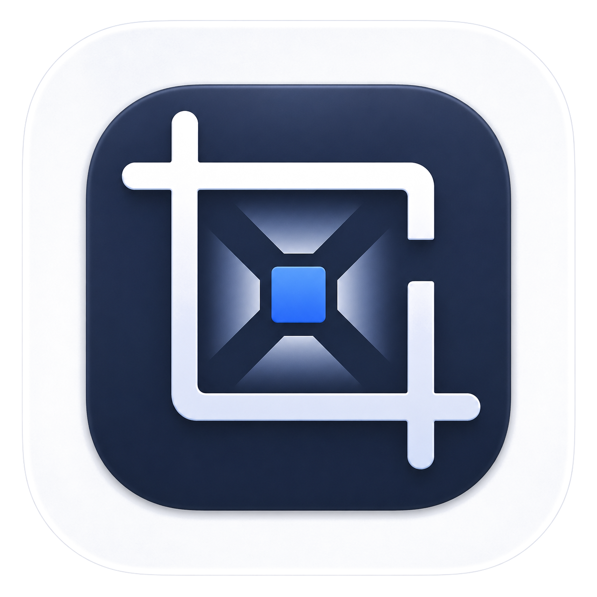

<div align="center">


# PicPress Media

**本地图片处理 · 视频压缩桌面工具 / Local Image & Video Desktop App**

[](LICENSE)
[](#下载--download)
[](https://go.dev)
[](https://vuejs.org)
[](https://www.electronjs.org)

[中文](#中文) · [English](#english)

</div>

---

## 中文

### 简介

PicPress Media 是一款开源的跨平台桌面应用，基于 **Electron + Vue 3 + Go** 构建，面向需要快速整理上传素材的用户。

- 图片支持单张编辑与批量压缩
- 视频支持单文件压缩，ffmpeg 已内置无需额外安装
- 所有处理均在本地完成，文件不会上传到外部服务
- 支持 macOS、Windows、Linux 三平台

### 功能特性

| 功能 | 说明 |
|------|------|
| 📐 单图处理 | 自由裁剪 / 比例锁定（1:1 · 4:3 · 16:9 · 9:16）/ 自定义像素尺寸 |
| 📦 批量图片 | 多图上传，统一压缩参数后批量导出 ZIP |
| 🗜 图片压缩 | 质量滑块 + 目标体积（KB）控制，自动降低质量以满足大小限制 |
| 🎬 单视频压缩 | 单个视频文件压缩，支持 MP4 / WebM 输出 |
| 🔄 格式转换 | 图片支持 JPG · PNG · WebP · AVIF |
| ↻ 旋转 / 翻转 | 单图支持顺 / 逆时针旋转与水平 / 垂直翻转 |
| 🌙 深色模式 | 深色 / 浅色一键切换，偏好持久化 |
| 📦 ffmpeg 内置 | 安装包内已包含 ffmpeg，无需系统单独安装 |

### 下载 / Download

前往 [Releases](https://github.com/Geniuskkk/ImageCroppingAndCompression/releases/latest) 页面下载对应平台安装包：

| 平台 | 安装包格式 |
|------|-----------|
| macOS (Apple Silicon / Intel) | `.dmg` |
| Windows | `.exe`（NSIS 安装向导）|
| Linux | `.AppImage` / `.deb` |

### 快速开始

**macOS：** 打开 `.dmg`，将应用拖入 `Applications` 文件夹，双击启动即可。

> 首次打开若提示「无法验证开发者」，请前往「系统设置 → 隐私与安全性」点击「仍要打开」。

**Windows：** 双击 `.exe` 安装向导，按提示完成安装，在开始菜单或桌面快捷方式启动。

**Linux：** AppImage 无需安装，赋予执行权限后直接运行：

```bash
chmod +x PicPress-Media-*.AppImage
./PicPress-Media-*.AppImage
```

### 技术架构

```
Electron 主进程
  ├── 启动 Go sidecar（内嵌后端，监听随机本地端口）
  ├── 注入 ffmpeg/ffprobe 路径给 Go 进程
  └── 创建窗口加载 Vue 3 前端

Go sidecar（HTTP API）
  ├── /api/process    — 单张图片处理（bimg/libvips）
  ├── /api/batch      — 批量图片处理
  └── /api/video/process — 视频压缩（bundled ffmpeg）
```

- **macOS 窗口行为**：点击红叉仅隐藏窗口，程序保留在 Dock；点击 Dock 图标恢复；`Cmd+Q` 正常退出并关闭后端进程。

### REST API

应用运行时会在本地随机端口提供 HTTP API，可被脚本或第三方工具调用（端口见启动日志）。

#### 健康检查

```http
GET /api/health
```

```json
{"status":"ok","version":"v1.0.0"}
```

#### 处理单张图片

```http
POST /api/process
Content-Type: multipart/form-data
```

| 参数 | 类型 | 说明 |
|------|------|------|
| `file` | File | 图片文件，必填 |
| `crop_x` / `crop_y` | int | 裁剪起点坐标 |
| `crop_w` / `crop_h` | int | 裁剪宽高 |
| `rotate` | int | 旋转角度：0 / 90 / 180 / 270 |
| `flip_h` / `flip_v` | `1` | 水平 / 垂直翻转 |
| `output_width` / `output_height` | int | 输出尺寸，0 表示不缩放 |
| `format` | string | `jpg` / `png` / `webp` / `avif` |
| `quality` | int | 质量 1-100 |
| `max_size_kb` | int | 目标体积上限（KB，0=不限）|

返回值为处理后的图片二进制。

#### 批量处理图片

```http
POST /api/batch
Content-Type: multipart/form-data
```

参数同单张图片处理，`files` 字段可传多个文件，返回 `application/zip`。

#### 压缩单个视频

```http
POST /api/video/process
Content-Type: multipart/form-data
```

| 参数 | 类型 | 说明 |
|------|------|------|
| `file` | File | 视频文件，必填 |
| `format` | string | 输出格式：`mp4` / `webm` |
| `quality` | int | 质量 1-100，仅在未设置目标体积时生效 |
| `max_size_mb` | int | 目标体积上限（MB，0=不限）|

- 设置 `max_size_mb` 后，服务端会根据视频时长估算目标码率
- MP4 输出使用 H.264 + AAC
- WebM 输出使用 VP9 + Opus

### 从源码构建

**本地依赖：**

- Go 1.22+
- Node.js 18+
- libvips（macOS: `brew install vips`，Ubuntu: `apt install libvips-dev`）

> ffmpeg 由 `ffmpeg-static` npm 包在开发时自动提供，打包时内置进安装包，无需手动安装。

```bash
git clone https://github.com/Geniuskkk/ImageCroppingAndCompression.git
cd ImageCroppingAndCompression

# 安装 Node 依赖
npm install --legacy-peer-deps

# 编译 Go sidecar（产物在 sidecar-bin/picpress）
npm run build:go

# 开发模式启动（Electron + HMR）
npm run dev

# 打包当前平台安装包（产物在 dist/）
npm run dist
```

**分平台打包：**

```bash
npm run dist:mac    # macOS DMG + ZIP
npm run dist:win    # Windows NSIS
npm run dist:linux  # AppImage + deb
```

> 注意：macOS 和 Windows 安装包必须分别在对应系统上构建（CGO 依赖 libvips 不支持交叉编译）。CI 构建请使用 GitHub Actions 多平台矩阵。

### 参与贡献

欢迎提交 Issue 和 Pull Request。

1. Fork 本仓库
2. 创建功能分支：`git checkout -b feat/my-feature`
3. 提交变更：`git commit -m 'feat: add my feature'`
4. 推送分支：`git push origin feat/my-feature`
5. 发起 Pull Request

---

## English

### Overview

PicPress Media is an open-source cross-platform desktop application built with **Electron + Vue 3 + Go**. It handles image processing and single-video compression entirely on your machine — nothing is uploaded to external services.

### Features

| Feature | Description |
|---------|-------------|
| 📐 Single Image | Free crop, aspect ratio lock, custom output size |
| 📦 Batch Images | Compress multiple images with shared settings, download as ZIP |
| 🗜 Image Compression | Quality slider plus target size in KB |
| 🎬 Single Video Compression | Compress one video and export as MP4 or WebM |
| 🔄 Format Convert | JPG / PNG / WebP / AVIF for images |
| ↻ Rotate / Flip | Rotate and flip single images |
| 🌙 Dark Mode | Toggle dark and light theme with persisted preference |
| 📦 Bundled ffmpeg | ffmpeg is included in the installer — no separate install needed |

### Download

Get the latest build from [Releases](https://github.com/Geniuskkk/ImageCroppingAndCompression/releases/latest):

| Platform | Format |
|----------|--------|
| macOS (Apple Silicon / Intel) | `.dmg` |
| Windows | `.exe` (NSIS installer) |
| Linux | `.AppImage` / `.deb` |

### Quick Start

**macOS:** Open the `.dmg`, drag the app to `Applications`, and double-click to launch.

> If macOS shows "unidentified developer", go to **System Settings → Privacy & Security** and click **Open Anyway**.

**Windows:** Run the `.exe` installer and follow the wizard.

**Linux:** Make the AppImage executable and run it:

```bash
chmod +x PicPress-Media-*.AppImage
./PicPress-Media-*.AppImage
```

### Architecture

```
Electron main process
  ├── Spawns Go sidecar (listens on a random local port)
  ├── Injects ffmpeg/ffprobe paths into Go process env
  └── Opens BrowserWindow loading the Vue 3 frontend

Go sidecar (HTTP API)
  ├── /api/process          — Single image processing (bimg/libvips)
  ├── /api/batch            — Batch image processing
  └── /api/video/process    — Video compression (bundled ffmpeg)
```

- **macOS window behaviour**: Clicking ✕ hides the window; the app stays in the Dock. Click the Dock icon to restore. `Cmd+Q` quits the app and terminates the Go sidecar.

### REST API

The app exposes a local HTTP API on a random port (shown in the startup log).

#### Health Check

```http
GET /api/health
```

#### Process a Single Image

```http
POST /api/process
Content-Type: multipart/form-data
```

| Parameter | Type | Description |
|-----------|------|-------------|
| `file` | File | Image file, required |
| `crop_x` / `crop_y` | int | Crop origin |
| `crop_w` / `crop_h` | int | Crop width and height |
| `rotate` | int | Rotation: 0 / 90 / 180 / 270 |
| `flip_h` / `flip_v` | `1` | Horizontal / vertical flip |
| `output_width` / `output_height` | int | Output size, 0 = disabled |
| `format` | string | `jpg` / `png` / `webp` / `avif` |
| `quality` | int | Quality 1–100 |
| `max_size_kb` | int | Target size limit in KB |

#### Batch Images

```http
POST /api/batch
Content-Type: multipart/form-data
```

Send multiple files in the `files` field. Response is a ZIP archive.

#### Compress a Single Video

```http
POST /api/video/process
Content-Type: multipart/form-data
```

| Parameter | Type | Description |
|-----------|------|-------------|
| `file` | File | Video file, required |
| `format` | string | `mp4` or `webm` |
| `quality` | int | Quality 1–100 (ignored when `max_size_mb` > 0) |
| `max_size_mb` | int | Target size limit in MB |

- MP4: H.264 + AAC
- WebM: VP9 + Opus

### Build from Source

**Prerequisites:**

- Go 1.22+
- Node.js 18+
- libvips (macOS: `brew install vips`, Ubuntu: `apt install libvips-dev`)

> ffmpeg is provided automatically via `ffmpeg-static` in development and bundled into the installer for production.

```bash
git clone https://github.com/Geniuskkk/ImageCroppingAndCompression.git
cd ImageCroppingAndCompression

npm install --legacy-peer-deps
npm run build:go   # compile Go sidecar → sidecar-bin/picpress
npm run dev        # launch Electron in development mode
npm run dist       # package for the current platform
```

**Platform-specific packages:**

```bash
npm run dist:mac    # macOS DMG + ZIP
npm run dist:win    # Windows NSIS
npm run dist:linux  # AppImage + deb
```

> macOS and Windows packages must be built on their respective OS due to CGO (libvips). Use GitHub Actions matrix builds for CI.

### Contributing

Issues and Pull Requests are welcome.

### License

[MIT](LICENSE) © 2026 PicPress Media Contributors

